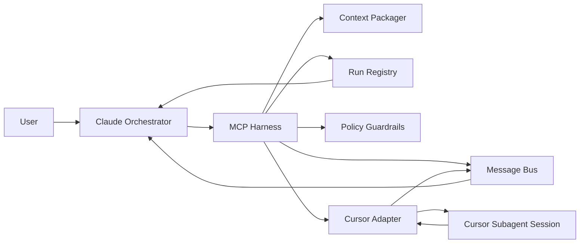
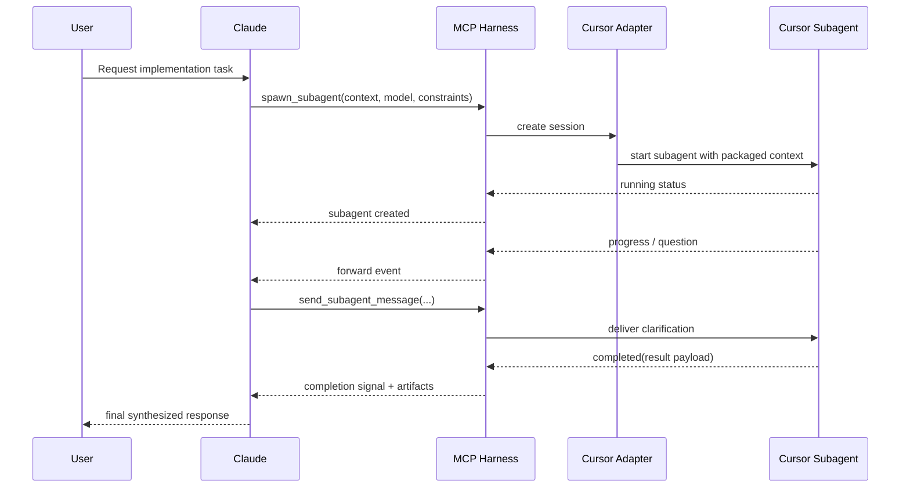
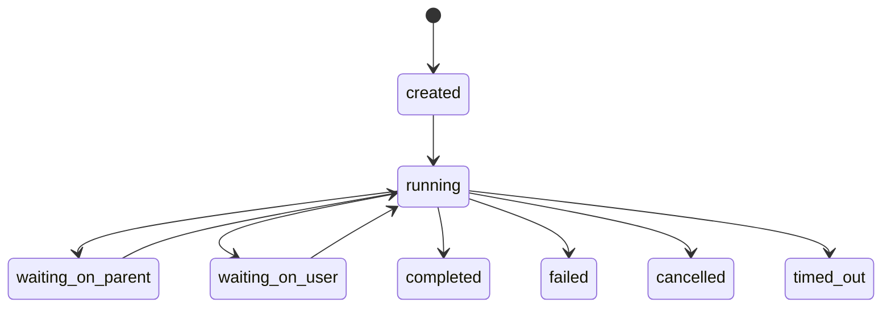

# [PRD] Claude--Cursor Harness

**Product:** MCP harness for Claude-orchestrated Cursor subagents.[1]

**Objective:** Give Claude a reliable way to spawn Cursor subagents, pass scoped context, choose the model, exchange messages during execution, and receive an explicit done signal with structured output.[1]

**Problem:** Delegation between Claude and Cursor is usually manual, which creates copy/paste friction, weak auditability, and poor lifecycle control.[1]

**Goals:**
- Spawn Cursor subagents on demand.[1]
- Pass bounded context bundles, not the full parent thread by default.[1]
- Configure model and reasoning profile per run, subject to policy.[1]
- Support bidirectional messaging while the subagent is active.[1]
- Emit structured lifecycle and completion events.[1]

**Non-goals:**
- Replacing Claude as the main orchestrator.[1]
- Allowing unrestricted tool or filesystem access by default.[1]
- Building a generic all-provider mesh in v1.[1]

## Core requirements

The harness should support six core capabilities: spawn, context packaging, model configuration, bidirectional messaging, lifecycle signalling, and multi-subagent management.[1]

A minimal v1 API surface should include:
- `spawn_subagent`
- `send_subagent_message`
- `get_subagent_status`
- `list_subagents`
- `cancel_subagent`
- `subagent_event` webhook or stream payload[1]

A completion payload should include status, summary, artifacts, test results, open questions, and next action so Claude can synthesize the result back into the parent flow cleanly.[1]

## Architecture

A clean v1 architecture is Claude -> MCP Harness -> Cursor Adapter -> Cursor Subagent Session, with the harness owning context packing, policy checks, run registry, and the message/event bus.[1]

The sequence should let Claude create a run, receive progress or clarification events, reply back into the same session, and finally consume a single structured completion signal.[1]

## Data model

The minimum useful entities are `ParentTask`, `SubagentRun`, `ContextBundle`, `Message`, `Artifact`, and `Event`.[1]

| Entity | Key fields | Notes |
|---|---|---|
| ParentTask | id, conversation_id, goal [1] | Top-level Claude task [1] |
| SubagentRun | subagent_id, parent_task_id, provider, model, status, started_at, ended_at [1] | One delegated run [1] |
| ContextBundle | bundle_id, transcript_excerpt, files, constraints, output_schema [1] | Scoped context payload [1] |
| Message | message_id, subagent_id, direction, type, content, timestamp [1] | Two-way comms log [1] |
| Artifact | artifact_id, subagent_id, type, ref, metadata [1] | Patch, logs, tests, summary [1] |
| Event | event_id, subagent_id, event_type, payload, timestamp [1] | Lifecycle and completion signal [1] |

For state transitions, `created`, `running`, `waiting_on_parent`, `waiting_on_user`, `completed`, `failed`, `cancelled`, and `timed_out` are enough for a good first version.[1]

## Recommended v1

The sharpest v1 is single-provider, API-first, with Cursor as the only execution backend and Claude as the only parent orchestrator.[1]

Recommended scope:
- Cursor-only adapter.[1]
- Explicit spawn/message/status/cancel operations.[1]
- Structured completion event emitted exactly once.[1]
- Model override with allowlist validation.[1]
- Lightweight operator view showing run status, model, context bundle, and latest message.[1]

Two practical product decisions matter early:
- Prefer one-shot task runs over long-lived sessions for v1; it keeps lifecycle simpler.
- Support both polling and event push later, but start with polling plus append-only event history for easier implementation.[1]
